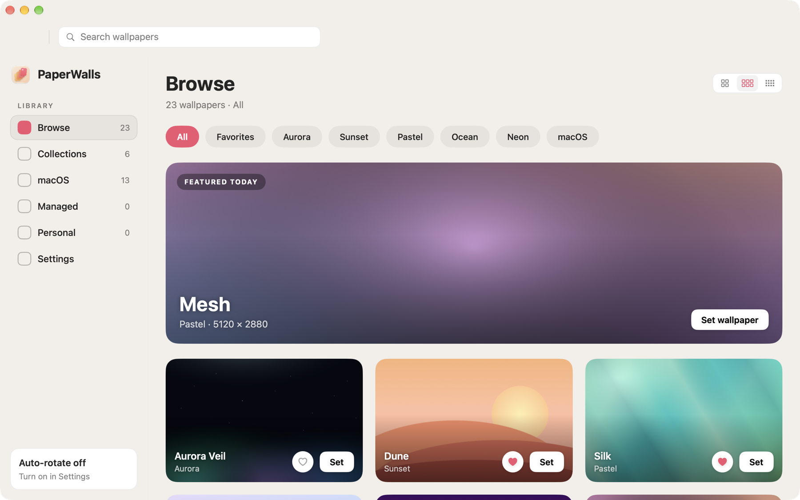
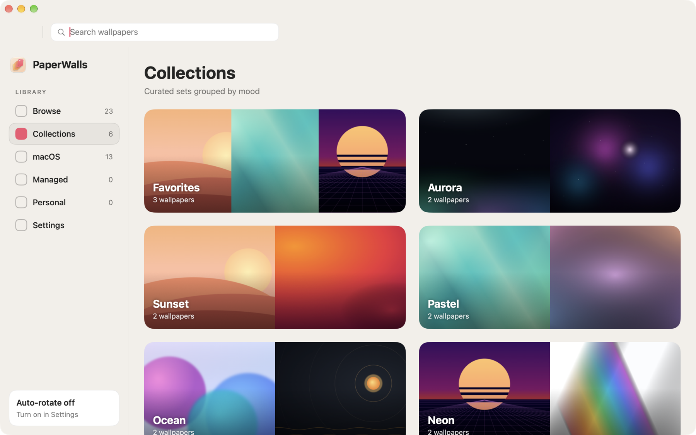
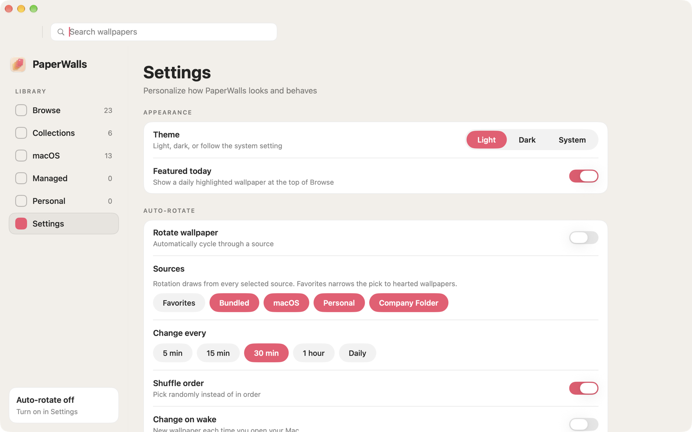
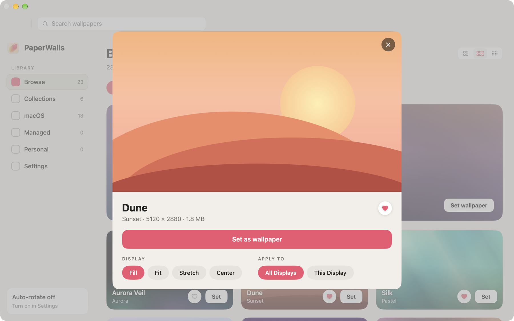
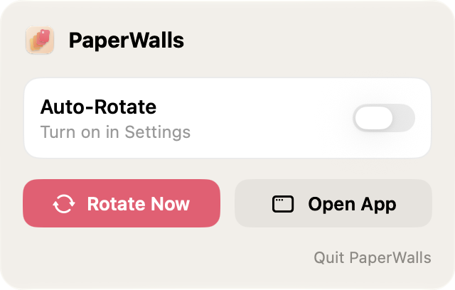

# PaperWalls

A macOS wallpaper manager for managed fleets: a SwiftUI picker app for curated,
app-bundled wallpapers, a `desktoppr`-style CLI (`paperwallscli`), and full
configurability via MDM configuration profiles.



| Collections | Settings |
| --- | --- |
|  |  |

| Detail sheet | Menu bar panel |
| --- | --- |
|  |  |

## Project layout

Single plain Xcode project (`PaperWalls.xcodeproj`), no SPM packages. Four
pieces, three product targets (plus the unit-test target):

| Path | Target(s) | Purpose |
| --- | --- | --- |
| `App/` | PaperWalls | SwiftUI app: the library pages (Browse/Collections/macOS/Managed/Personal/ScreenSavers), Studio, and Settings |
| `Saver/` | PaperWallsSaver | `PaperWalls.saver` — a real macOS screen saver that plays the scene chosen in the app; also embedded in the app as the template for per-scene copies |
| `CLI/` | paperwallscli | Command-line tool (`get`/`set`/`manage`/`version`/`help`) |
| `Shared/` | several | Engine, catalog, preference, and scene logic shared via target membership |
| `Tests/` | PaperWallsTests | Unit tests for the pure logic in `Shared/` |
| `Resources/Wallpapers/` | PaperWalls | Bundled images + `catalog.json` (copied as a folder reference) |
| `Deployment/` | — | Sample `.mobileconfig`, Jamf custom schema (`.schema.json`), LaunchAgent plist, and `build-pkg.sh` |

The GUI is a single library window: **Browse** (everything — bundled,
personal, and managed — with All / Favorites / collection / source filter
chips and a daily "Featured today" hero), **Collections** (mood groupings
from `catalog.json`, plus a Favorites collection), **Personal** (the user's
own folder — pick it with the file dialog or drag a folder from Finder onto
the page), **Managed** (the MDM-provisioned folder, read-only when forced),
and **Settings**. Every card offers favorite (heart) and one-click **Set**,
clicking a card opens a detail sheet with display/target options, and the
current desktop picture is badged **ACTIVE**. Auto-rotate cycles the desktop
through favorites, all sources, or the company folder on a configurable
interval while the app is running.

**Screen savers.** The **ScreenSavers** page (Library) holds the screen
savers you make; **Studio** (Tools) is where you compose them — start from a
preset (Bouncing Clock, Floating Message, Minimal Clock, Help Desk Contact)
or a blank scene, then add clock, text, and icon layers over a background
(the current desktop picture, a specific wallpaper, a rotating pool, a color,
or a gradient) with a live preview. **Set Active** on a card makes that scene
what `PaperWalls.saver` shows; pick the saver itself once in System Settings
› Screen Saver › Other. A scene can also get **its own tile** there ("Show in
System Settings" on its card): the app generates a per-scene copy of the saver
in `~/Library/Screen Savers`, with that scene's thumbnail. Settings is always
the last sidebar item.

Shared sources (`WallpaperEngine.swift`, `PreferencesStore.swift`,
`ManagedPreferences.swift`, `WallpaperCatalog.swift`) are compiled into **both**
targets via Target Membership — no framework, no package.

## Building

Open `PaperWalls.xcodeproj` in Xcode (14+) and build the `PaperWalls` or
`paperwallscli` scheme, or from the command line:

```sh
xcodebuild -project PaperWalls.xcodeproj -scheme PaperWalls   -configuration Release build
xcodebuild -project PaperWalls.xcodeproj -scheme paperwallscli -configuration Release build
```

The project builds with ad-hoc signing (`Sign to Run Locally`) out of the box.
For distribution, set your team + Developer ID identity on both targets.

## CLI usage

```sh
paperwallscli get                    # print wallpaper path per screen
paperwallscli get 1                  # just screen index 1
paperwallscli set ~/Pictures/x.jpg   # set on all screens (default)
paperwallscli set x.jpg 0 --scale fit --color 1D2E3F
paperwallscli set x.jpg --all-screens
paperwallscli manage                 # apply MDM/user preferences
paperwallscli screensaver            # print what the screen saver will show + macOS's clock state (read-only)
paperwallscli screensaver enforce    # select enforcedScreenSaverPath everywhere + apply hideSystemSaverClock now (as the user; as root: the lock screen half only)
paperwallscli screensaver clock --watch  # stay resident and re-apply hideSystemSaverClock whenever System Settings changes it (the pkg's clock watchers)
paperwallscli version
paperwallscli help
```

Exit codes: `0` success · `1` usage · `2` bad file · `3` bad screen ·
`4` set failed · `5` ran as root · `6` selection locked by policy
(`set` refuses to run while `lockSelection` is active; only `manage` may
change the wallpaper then).

**Run as the logged-in user, never root.** The desktop picture is a per-user,
per-session setting; `set`/`manage` refuse to run as root (exit 5). A ~1 second
delay is inserted between per-screen set calls (same workaround desktoppr uses
for flaky rapid calls on multi-display Macs).

`paperwallscli manage` resolves `selectedWallpaperID` against the bundled
catalog (locating `PaperWalls.app` next to the binary, in `/Applications`,
`~/Applications`, or via LaunchServices) and the external folder; a plain
absolute path (or `~/…`) also works as the ID.

## Managed preference keys

Domain: **`com.herojoneslabs.paperwalls`** (one constant,
`ManagedPreferences.domain` — rename there plus in the two Deployment files).
Read/written via `CFPreferences*` so `/Library/Managed Preferences/` profiles
are honored; `CFPreferencesAppValueIsForced` decides managed-vs-local per key.

| Key | Type | Default | Meaning |
| --- | --- | --- | --- |
| `selectedWallpaperID` | string | — | `CuratedWallpaper.id` to apply (`bundled-…`, `file:<hash>` for folder wallpapers, or an absolute path; legacy `external-…` IDs still resolve) |
| `scale` | string | `fill` | `fill` \| `fit` \| `stretch` \| `center` |
| `fillColor` | string | — | Optional 6-digit hex letterbox color |
| `applyToAllScreens` | bool | `true` | `manage` targets all screens vs. main screen |
| `lockMode` | string | `off` | Lock tier: `off` \| `soft` (only the managed selection applies; controls grey out) \| `hard` (nothing applies, no exit — pair with the Tier-2 OS profile; the app reports "Enforced by profile" vs "App-only") \| `enforcedRotation` (rotation continues within `allowedWallpaperIDs`) |
| `lockSelection` | bool | `false` | **Legacy** — superseded by `lockMode`; `true` maps to `soft` (or `hard` with a forced `allowLockExit=false`) |
| `allowLockExit` | bool | `true` | Soft lock only: `true` lets the user leave the locked view and browse read-only. Not exposed in the Settings UI so users can't trap themselves |
| `allowedWallpaperIDs` | array of strings | — | Optional; restricts the picker grid to these IDs |
| `externalWallpaperFolderPath` | string | — | Managed folder scanned (non-recursive) for `.jpg .jpeg .png .heic .tiff`; surfaces as the "Managed" source |
| `showBundledWallpapers` | bool | `true` | `false` hides the bundled set; with no folder images the picker shows an empty state (never silently falls back) |
| `showSystemWallpapers` | bool | `true` | Shows Apple's built-in wallpapers (`/System/Library/Desktop Pictures`) as the "macOS" source, including an on-demand download section for the `.madesktop` assets |
| `allowSystemWallpaperDownloads` | bool | `true` | Permits on-demand fetches of Apple's built-in wallpapers from Apple's CDN when the user clicks Download; force `false` on network-restricted fleets |
| `companyName` | string | — | Org branding: the Managed source shows "<Name> (Managed)" in the sidebar, "<Name>" on the Browse filter, "<Name> Feed" for the org feed |
| `showFeaturedWallpaper` | bool | `true` | Shows/hides the daily "Featured today" hero at the top of Browse |

Additional keys in the same domain (primarily user-level, but forceable by a
profile exactly like the ones above):

| Key | Type | Default | Meaning |
| --- | --- | --- | --- |
| `personalFolderSource` | string | `appManaged`* | `appManaged` (fixed app-owned folder `~/Library/Application Support/PaperWalls/Personal/`, images added by dropping them onto the Personal page) \| `userDefined` (uses `personalWallpaperFolderPath`). *A Mac that already has `personalWallpaperFolderPath` set keeps working as `userDefined` |
| `personalWallpaperFolderPath` | string | — | The user's own wallpaper folder (used in `userDefined` mode) |
| `appCuratedEnabled` | bool | `false` | Downloads the PaperWalls curated feed (Ed25519-signed manifest, cached, sha256-verified). Off = zero network from this source |
| `orgCatalogEnabled` | bool | `false` | Enables an organization wallpaper feed (requires the two keys below) |
| `orgCatalogURL` | string | — | HTTPS URL of the org feed's `catalog.json` (v2; signature expected at `<url>.sig`) |
| `orgCatalogPublicKey` | string | — | Base64 raw-32-byte Ed25519 public key that signs the org manifest |
| `favoriteWallpaperIDs` | array of strings | — | Hearted wallpapers |
| `autoRotateEnabled` | bool | `false` | Rotate the desktop automatically while the app runs |
| `autoRotateIntervalMinutes` | integer | `30` | Minutes between rotations (Settings offers 5/15/30/60/1440) |
| `rotationPool` | array of strings | all real sources | What rotation draws from: any of `favorites`, `bundled`, `system`, `appCurated`, `orgRemote`, `orgFolder`, `personal`. `favorites` narrows the pick to hearted wallpapers; an empty array means "nothing to rotate" (keep the current wallpaper). Sources whose gate is off contribute nothing |
| `autoRotateShuffle` | bool | `true` | Pick randomly instead of in order |
| `autoRotateOnWake` | bool | `false` | New wallpaper each time the Mac wakes |
| `appearanceTheme` | string | `light` | Window theme: `light` \| `dark` \| `system` (follows macOS appearance) |
| `gridColumns` | integer | `2` | Wallpaper grid density (2–4 columns; the header view control) |

Screen savers and Studio (same domain, same forcing rules):

| Key | Type | Default | Meaning |
| --- | --- | --- | --- |
| `screenSaverEnabled` | bool | `true` | Master switch for the PaperWalls screen saver; `false` makes the saver show a solid color and nothing else |
| `activeScreenSaverSceneID` | string | — | The scene the saver runs: a scene's UUID from the user's library, or `managed` for the scene provisioned by `managedScreenSaverScene`. Forcing it disables **Set Active** |
| `managedScreenSaverScene` | string (JSON) | — | An organization-provided scene, shown as a read-only **Managed** entry (ID `managed`). Build it in Studio and use the card's **Copy Scene for MDM** action (shown in Admin mode). In `managed.json` it may be an inline object instead of a string |
| `allowedScreenSaverSceneIDs` | array of strings | — | Optional allow-list of scene IDs that may be active; other scenes stay visible but can't be set active |
| `enforcedScreenSaverPath` | string | — | Full path of a saver to keep selected for every Space and display, e.g. `/Library/Screen Savers/PaperWalls.saver`. Applied by `paperwallscli manage` (login + hourly) or `paperwallscli screensaver enforce`; users' own picks are switched back. On macOS 14+ Apple's `moduleName` only *locks* the choice, it doesn't select a third-party saver: pair the two for a selected, locked saver (Admin Guide §12) |
| `hideSystemSaverClock` | string | `never` | What to do about the large clock macOS draws over every screen saver and on the lock screen (System Settings › Wallpaper › Clock Appearance › **Show large clock**) — two clocks, when the scene has one. `never` leaves it to macOS; `whenSceneHasClock` turns it off while the selected saver is a PaperWalls saver whose scene draws a clock, and puts the user's value back otherwise; `always` keeps it off. The screen saver half (the user's `com.apple.screensaver` `showClock`, per host) is applied by the app, `paperwallscli manage`, and `paperwallscli screensaver enforce`. The lock screen half (`/Library/Preferences/com.apple.loginwindow` `UsesLargeDateTime`) is system-level and needs root: the pkg postinstall, `paperwallscli screensaver enforce` run as root, or Settings › **Apply as Admin…**. A profile that forces either key wins (Admin Guide §12) |
| `hideSystemSaverClockOnLockScreen` | bool | `true` | With `hideSystemSaverClock`: also cover the lock screen half. `false` leaves the lock screen clock alone (and restores it if PaperWalls had hidden it) |
| `allowScreenSaverCreation` | bool | `true` | `false` = users can't create, edit, rename, or delete scenes (Studio's ScreenSaver tab is unavailable); they can still browse, preview, and Set Active |
| `showScreenSaversPage` | bool | `true` | Shows/hides the ScreenSavers page in the sidebar's Library section |
| `showStudio` | bool | `true` | Shows/hides Studio (the sidebar's Tools section) |
| `showStudioWallpapersTab` | bool | `true` | Shows/hides Studio's Wallpapers tab (the wallpaper composer) |
| `showStudioScreenSaverTab` | bool | `true` | Shows/hides Studio's ScreenSaver tab (the Scene Composer). With both tabs hidden, Studio is hidden |
| `adminModeEnabled` | bool | `false` | Admin tools: Studio's **Assets** tab (a library of your logos and icons, offered as **Brand Assets** in the composer), Studio's **Package** tab (build a deployable pkg of screen savers or wallpapers), **Package for Deployment…** on cards, and the **Copy Scene for MDM** card action. Force `false` to keep them off a fleet; the Assets and Package tabs ignore `showStudio` so an admin's own Mac keeps them |
| `brandAssetsFolderPath` | string | — | Folder of your logos and icons (e.g. `/Library/CompanyBrand`), scanned non-recursively for `.png .jpg .jpeg .heic .tiff .gif`. Its images are offered as read-only **Brand Assets** in Studio's composer on every Mac; names come from the file names. Deploy the images separately (Admin Guide §12) |
| `jamfPublishEnabled` | bool | `false` | Admin mode only: adds a **Publish to Jamf Pro** step after a Studio › Package build that uploads the result through the Jamf Pro API. Nothing is sent until the admin presses Publish. The server URL and API client are entered in Settings › Admin on the admin's Mac (user layer + Keychain) and are deliberately **not** managed keys — a profile can't point the app at another server (Admin Guide §12) |
| `jamfPublishPackages` | bool | `true` | With publishing on: allow uploading the built installer package (`/api/v1/packages` + file upload; API role needs Create, Read, and Update Packages; Jamf Pro 11.5+ with a cloud distribution point) |
| `jamfPublishProfiles` | bool | `true` | With publishing on: allow creating the `Enforce/` and `Configure/` `.mobileconfig` files as unscoped, computer-level macOS configuration profiles (Classic API; API role needs Create, Read, and Update macOS Configuration Profiles) |
| `aiGenerationEnabled` | bool | `false` | Master switch for AI-generated wallpaper backgrounds in Studio › Wallpapers. `false` hides every AI control regardless of the provider toggles |
| `aiAppleOnDeviceEnabled` | bool | `false` | Offers **Apple On-Device** generation (Image Playground via Apple Intelligence; runs entirely on the Mac). Needs Apple silicon with Apple Intelligence on |
| `aiLocalModelEnabled` | bool | `false` | Offers **Local Model** generation: an image server on the Mac or the network (Draw Things, Automatic1111, Forge, SD.Next, or any OpenAI-compatible endpoint). Prompts go only to `aiLocalModelEndpoint`, and only when the user presses Generate |
| `aiLocalModelEndpoint` | string | — | Base URL of the local image server, e.g. `http://127.0.0.1:7860`. No scheme means `http://` |
| `aiLocalModelFlavor` | string | `automatic1111` | The server's API: `automatic1111` (`/sdapi/v1/txt2img`; also Draw Things, Forge, SD.Next) or `openAICompatible` (`/v1/images/generations`) |
| `aiLocalModelName` | string | — | Optional model/checkpoint name sent with each request; empty uses the server's default |
| `aiLocalModelImageSize` | string | `match` | Width × height asked of the server: `match` (wide, tall, or square to suit the wallpaper's shape), `1024x1024`, `1344x768`, `768x1344`, or any `WxH` between 64 and 4096 |
| `aiExternalModelEnabled` | bool | `false` | Offers **External Model** generation: a cloud image service (Google Gemini image models, OpenAI, or any OpenAI-compatible endpoint). Prompts go only to the chosen service, and only when the user presses Generate. API keys live in the user's Keychain, never in this domain |
| `aiExternalProvider` | string | `google` | Which service: `google` (`generativelanguage.googleapis.com`), `openAI` (`api.openai.com`), or `openAICompatible` (`aiExternalEndpoint`) |
| `aiExternalEndpoint` | string | — | OpenAI-compatible only: base URL of the service, e.g. `https://images.example.com`. No scheme means `https://` |
| `aiExternalModelName` | string | — | Optional model name; empty sends the service default (`gemini-2.5-flash-image`, `gpt-image-1`) |
| `aiExternalImageShape` | string | `matchWallpaper` | `matchWallpaper` (follows the wallpaper's shape), `square`, `landscape`, or `portrait`, mapped to each service's size vocabulary |
| `aiPromptImproverEnabled` | bool | `false` | Adds an **Improve** button beside the description in Studio: Claude (Anthropic Messages API, `api.anthropic.com`) rewrites the idea into a detailed image prompt. Claude doesn't make images. Needs the user's Anthropic API key in their Keychain |
| `aiPromptImproverModel` | string | `claude-opus-5-5` | The Claude model used by Improve |

There is deliberately no idle-time key: when the screen saver starts is a
macOS setting. Set it (and select the saver) with a `com.apple.screensaver`
profile — see `Deployment/com.herojoneslabs.paperwalls.screensaver.mobileconfig`
and its caveats.

**How the saver gets its scene.** macOS runs third-party savers in a
sandboxed host that cannot read this preference domain, so the saver never
evaluates policy itself. The app (on any relevant change) and
`paperwallscli manage` (at login and hourly, via the LaunchAgent) resolve
the master switch, lock tier, allow-list, and active scene, and publish the
outcome to `~/Library/Application Support/PaperWalls/Studio/ActiveScreenSaver.json`,
which the saver reads each time it starts. Under `lockMode=hard` (or with
`screenSaverEnabled=false`) the saver shows a solid color; under `soft` only
the forced/managed scene applies; with nothing selected yet it shows a
built-in Minimal Clock.

Legacy rotation keys `autoRotateSource` and
`rotateIncludeBundled/Personal/Managed` are **migrated into `rotationPool`**
(one-time, on first launch of this version; profiles still forcing the old
keys are translated live, so existing deployments keep working —
`favorites`→`["favorites"]`, `managed`→`["orgFolder"]`, `all`→the sources
whose include-flag was true).

Every key appears in the Settings window; keys forced by a profile render
disabled with a "Managed by your organization" badge (including the Browse…
button for the external folder). Unforced keys stay editable and persist to
the same domain MDM writes to.

### Local admin config (no MDM / air-gapped)

Admins without MDM can drop `/Library/Application Support/PaperWalls/managed.json`
(or `managed.plist`, same shape — see `Deployment/managed.json.example`):
`"forced"` keys behave exactly like MDM-forced keys (badge, blocked writes);
`"defaults"` keys seed values the user may still override. Resolution order,
highest wins: **MDM forced → local forced → user value → local defaults →
built-in default**. The app live-reloads when the profile store or this file
changes — no relaunch needed. With no remote sources configured the app makes
no network calls, so a local-config-only, air-gapped deployment is fully
supported.

### Lock tiers

`lockMode` replaces the legacy `lockSelection`: **soft** is cooperative
(app + CLI refuse everything except the managed selection), **hard** is the
OS-level lock — deploy `Deployment/com.herojoneslabs.paperwalls.lock.mobileconfig`
(the app *detects* the restriction and reports "Enforced by configuration
profile" vs "App-only"), and **enforcedRotation** keeps rotating within
`allowedWallpaperIDs` (or, with no allow-list, within the resolved
`rotationPool`). Never combine the Tier-2 desktop override profile with
`enforcedRotation` — the OS override wins and the two fight.

**Tier 3 (reversion):** `paperwallscli watch` is a long-running per-user
watcher: under `enforcedRotation`, any desktop picture outside the approved
pool is reverted to the last-approved wallpaper within the poll interval
(default 15 s). Deploy `Deployment/com.herojoneslabs.paperwalls.watch.plist`
to `/Library/LaunchAgents/` (or build the pkg with `INSTALL_WATCH_AGENT=true`)
for fleets that use enforced rotation; the watcher idles cheaply in every
other lock mode and stands down entirely under a Tier-2/hard lock.

For Jamf Pro, `Deployment/com.herojoneslabs.paperwalls.schema.json` is a custom
schema for Application & Custom Settings (External Applications → Custom
Schema, preference domain `com.herojoneslabs.paperwalls`) — it renders every key as
a friendly form control; add only the keys you want to force.

Folder wallpaper IDs (`file:<hash>`) are derived from the file's *contents*
(byte size + SHA-256 fingerprint), so an ID survives renaming or moving the
file and is identical on every Mac that has the same image — an admin can pin
a folder file by ID fleet-wide. To find one, point the app at the folder and
read "Selected Wallpaper ID" in Settings after clicking it. Byte-identical
duplicates collapse to a single ID. Older path-derived `external-…` IDs still
resolve, and each user's favorites/selection are migrated to content IDs
automatically (hashes are cached per user, keyed by path + size + mtime, so
rescans only hash new or changed files).

## Documentation

- **[Administrator Guide](docs/ADMIN_GUIDE.md)** — installation, the full
  preference key reference, lock tiers, running your own wallpaper feed, CLI.
- **[Support Guide](docs/SUPPORT_GUIDE.md)** — triage table, diagnostics,
  logs, escalation checklist.
- **[User Guide](docs/USER_GUIDE.md)** — for the person using the Mac.
- **[Evaluation Guide](docs/EVALUATION_GUIDE.md)** — zero to a working managed
  test Mac in about 15 minutes.

## Deployment

Intended distribution: **signed + notarized `.pkg`**, not the App Store. The
app is deliberately **not sandboxed** — it must set the desktop picture, read
`/Library/Managed Preferences/`, and scan arbitrary local folders. (If it is
ever sandboxed, the external-folder feature needs security-scoped bookmarks;
see the `TODO` in `WallpaperCatalog.swift`.)

**`Deployment/build-pkg.sh`** builds the distribution pkg in one shot: both
schemes (Release, universal), Developer ID signing + optional notarization,
channel versioning (`1.0-d.x` dev → `1.0` GA), and a version bump — configure
the CONFIG block at the top and run it. Pkg payload:

- `PaperWalls.app` → `/Applications/` (marked non-relocatable)
- `paperwallscli` → `/usr/local/bin/`
- `Deployment/com.herojoneslabs.paperwalls.manage.plist` → `/Library/LaunchAgents/`
  (+ a postinstall that bootstraps the agent for the console user)
- `PaperWalls.saver` → `/Library/Screen Savers/` (`INSTALL_SAVER=true`, the
  default; signed with the app identity, notarized with the app when
  `NOTARIZE=true`; the postinstall restarts the screen saver host so an
  updated saver loads)

The LaunchAgent runs `paperwallscli manage` at login and hourly, so MDM
preference changes converge without user interaction. Load it immediately for
the console user with:

```sh
launchctl bootstrap gui/$(id -u <user>) /Library/LaunchAgents/com.herojoneslabs.paperwalls.manage.plist
```

`Deployment/com.herojoneslabs.paperwalls.mobileconfig` is a reference
`com.apple.ManagedClient.preferences` profile forcing every supported key —
trim it to the keys you actually want to manage (unlisted keys remain
user-editable). It is unsigned; sign/deploy through your MDM as usual.

## Bundled wallpapers

`Resources/Wallpapers/` ships 10 curated 5K (5120×2880) wallpapers — Aurora
Veil, Dune, Silk, Liquid, Retrowave, Mesh, Orbit, Ember, Nebula, Prism — each
with a pre-rendered 480px thumbnail, all listed in `catalog.json`. To add or
swap art: drop in the image + thumbnail, add/update the `catalog.json` entry
(`id`, `filename`, `displayName`, `thumbnailFilename`), and rebuild — the
folder is a folder reference, so new files are copied automatically.

## Curated feed constants

The app-curated feed URL and Ed25519 public key in `Shared/RemoteCatalog.swift`
(`RemoteFeed.appCurated`) are **placeholders** in this repository, as are the
bucket name and public URL in `Deployment/publish-feed.sh`. The feed is off by
default (`appCuratedEnabled=false`); to use it, host your own signed feed (see
the Administrator Guide), then set those constants before building — or leave
them alone and use the org feed keys (`orgCatalogURL` + `orgCatalogPublicKey`),
which need no rebuild.

## License

Apache License 2.0 — see [LICENSE](LICENSE). The scripts under `Deployment/`
run as root and change system state; test before deploying. Provided as is.
